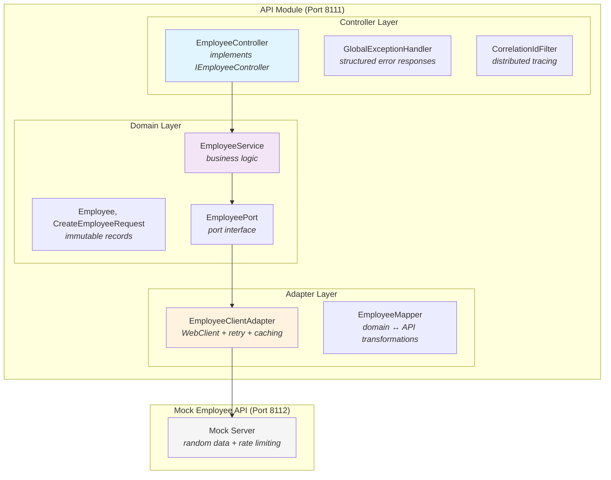

# ReliaQuest Coding Challenge - Solution

## Table of Contents

- [Solution Overview](#solution-overview)
  - [Key Architectural Decisions](#key-architectural-decisions)
  - [Architecture](#architecture)
  - [Resilience Features](#resilience-features)
  - [Implementation Details](#implementation-details)
  - [Development History](#development-history)
  - [Future Improvements](#future-improvements)
- [Getting Started](#getting-started)
  - [Prerequisites](#prerequisites)
  - [Quick Start with Doctor Script](#quick-start-with-doctor-script)
  - [Running the Application Manually](#running-the-application-manually)
  - [Running Tests](#running-tests)
  - [Code Formatting](#code-formatting)
- [API Reference](#api-reference)
  - [Endpoints to Implement](#endpoints-to-implement-api-module)
  - [Mock Employee API Endpoints](#mock-employee-api-endpoints-server-module)
- [Technical Notes](#technical-notes)
  - [Mock Server Behavior](#mock-server-behavior)
  - [Known Limitations](#known-limitations)
  - [Configuration](#configuration)

---

## Solution Overview

This implementation delivers a production-ready REST API that consumes the Mock Employee API, with emphasis on **clean architecture**, **resilience patterns**, and **comprehensive testing**.

### Key Architectural Decisions

| Requirement | Implementation | Why |
|-------------|----------------|-----|
| **Clean coding practices** | Hexagonal architecture with ports/adapters separation | Domain logic isolated from infrastructure concerns |
| **Test driven development** | 80%+ unit test coverage + WireMock integration tests | Tests verify both unit behavior and full HTTP request/response cycles |
| **Logging** | SLF4J with correlation IDs via MDC | Distributed tracing support for request tracking |
| **Scalability** | In-memory caching + retry with exponential backoff | Handles rate limiting gracefully without overwhelming the server |

### Architecture



### Resilience Features

**Rate Limiting Handling**
- **Caching**: In-memory cache for `getAllEmployees` with configurable TTL (default 30s)
- **Retry Logic**: Exponential backoff (3 attempts, 500ms → 1s → 2s delay)
- **Circuit Breaking**: Service unavailable exceptions after retry exhaustion

**Error Handling**
- Correlation IDs in all log entries and error responses
- Structured JSON error responses with proper HTTP status codes
- Bean validation with detailed field-level error messages

### Implementation Details

#### All 7 Endpoints Implemented

| Endpoint | Method | Description |
|----------|--------|-------------|
| `/employees` | GET | Returns all employees (cached) |
| `/employees/search/{searchString}` | GET | Case-insensitive name search |
| `/employees/{id}` | GET | Get employee by UUID |
| `/employees/highestSalary` | GET | Returns highest salary integer |
| `/employees/topTenHighestEarningEmployeeNames` | GET | Top 10 earners (names only) |
| `/employees` | POST | Create employee (returns 201) |
| `/employees/{id}` | DELETE | Delete by ID (returns name) |

#### Testing Strategy

- **Unit Tests**: Service, client adapter, mapper, controller, exception handler, filter
- **Integration Tests**: WireMock-based tests verifying retry behavior, error handling, and full HTTP cycles
- **Manual Testing**: HTTP request file at `api/src/test/http/employee-api.http`

**Why WireMock instead of the Mock Server?**

The integration tests use WireMock rather than the bundled mock server for several reasons:

1. **Deterministic behavior**: The mock server randomly rate-limits requests, which would make tests flaky and unpredictable in CI
2. **Precise control**: WireMock allows us to test specific scenarios (429 responses, timeouts, malformed JSON) that the mock server cannot reliably reproduce
3. **Test isolation**: Each test can configure exact responses without affecting other tests
4. **Industry standard**: Using HTTP mocking libraries for integration tests is standard practice for testing HTTP clients

The mock server remains valuable for manual testing and exploratory development where realistic, varied behavior is beneficial.

### Development History

This solution was built incrementally through a series of focused PRs:

| PR | Description |
|----|-------------|
| [#1](https://github.com/bjcoombs/java-employee-challenge/pull/1) | GitHub Actions CI pipeline with automated code review |
| [#2](https://github.com/bjcoombs/java-employee-challenge/pull/2) | Upgrade to Java 25, Spring Boot 4.0, Gradle 9.2.1 |
| [#3](https://github.com/bjcoombs/java-employee-challenge/pull/3) | Domain models using immutable Java records |
| [#5](https://github.com/bjcoombs/java-employee-challenge/pull/5) | EmployeePort and EmployeeClientAdapter with retry logic |
| [#6](https://github.com/bjcoombs/java-employee-challenge/pull/6) | EmployeeService with business logic |
| [#7](https://github.com/bjcoombs/java-employee-challenge/pull/7) | Global exception handling with correlation IDs |
| [#8](https://github.com/bjcoombs/java-employee-challenge/pull/8) | EmployeeController implementing all 7 endpoints |
| [#9](https://github.com/bjcoombs/java-employee-challenge/pull/9) | Integration tests with WireMock for retry behavior |
| [#10](https://github.com/bjcoombs/java-employee-challenge/pull/10) | API startup and testing documentation |
| [#11](https://github.com/bjcoombs/java-employee-challenge/pull/11) | In-memory caching for getAllEmployees endpoint |

### Future Improvements

See [FUTURE_IMPROVEMENTS.md](FUTURE_IMPROVEMENTS.md) for a comprehensive list of:
- Critical issues to address before production
- Technical debt from PR code reviews
- Enhancement opportunities
- Suggested implementation order

---

## Getting Started

### Prerequisites

- Java 25+
- Gradle 9.2.1+ (wrapper included)

### Quick Start with Doctor Script

Run the doctor script to validate your environment and optionally start both services:

```bash
# Check dependencies only
./doctor.sh

# Check dependencies and start both services
./doctor.sh --start
```

### Running the Application Manually

1. **Start the Mock Employee API** (required first):
   ```bash
   ./gradlew server:bootRun
   ```

2. **Start the Employee API** in a separate terminal:
   ```bash
   ./gradlew api:bootRun
   ```

3. **Test the endpoints** at http://localhost:8111

### Running Tests

```bash
# All tests
./gradlew test

# API module only
./gradlew api:test

# With coverage report
./gradlew test jacocoTestReport
```

### Code Formatting

```bash
# Check formatting
./gradlew spotlessCheck

# Apply formatting fixes
./gradlew spotlessApply
```

---

## API Reference

### Endpoints to Implement (API module)

_See `com.reliaquest.api.controller.IEmployeeController` for details._

#### getAllEmployees()

    output - list of employees
    description - this should return all employees

#### getEmployeesByNameSearch(...)

    path input - name fragment
    output - list of employees
    description - this should return all employees whose name contains or matches the string input provided

#### getEmployeeById(...)

    path input - employee ID
    output - employee
    description - this should return a single employee

#### getHighestSalaryOfEmployees()

    output - integer of the highest salary
    description - this should return a single integer indicating the highest salary of amongst all employees

#### getTop10HighestEarningEmployeeNames()

    output - list of employees
    description - this should return a list of the top 10 employees based off of their salaries

#### createEmployee(...)

    body input - attributes necessary to create an employee
    output - employee
    description - this should return a single employee, if created, otherwise error

#### deleteEmployeeById(...)

    path input - employee ID
    output - name of the employee
    description - this should delete the employee with specified id given, otherwise error

### Mock Employee API Endpoints (Server module)

    request:
        method: GET
        full route: http://localhost:8112/api/v1/employee
    response:
        {
            "data": [
                {
                    "id": "4a3a170b-22cd-4ac2-aad1-9bb5b34a1507",
                    "employee_name": "Tiger Nixon",
                    "employee_salary": 320800,
                    "employee_age": 61,
                    "employee_title": "Vice Chair Executive Principal of Chief Operations Implementation Specialist",
                    "employee_email": "tnixon@company.com",
                },
                ....
            ],
            "status": "Successfully processed request."
        }
---
    request:
        method: GET
        path:
            id (String)
        full route: http://localhost:8112/api/v1/employee/{id}
        note: 404-Not Found, if entity is unrecognizable
    response:
        {
            "data": {
                "id": "5255f1a5-f9f7-4be5-829a-134bde088d17",
                "employee_name": "Bill Bob",
                "employee_salary": 89750,
                "employee_age": 24,
                "employee_title": "Documentation Engineer",
                "employee_email": "billBob@company.com",
            },
            "status": ....
        }
---
    request:
        method: POST
        body:
            name (String | not blank),
            salary (Integer | greater than zero),
            age (Integer | min = 16, max = 75),
            title (String | not blank)
        full route: http://localhost:8112/api/v1/employee
    response:
        {
            "data": {
                "id": "d005f39a-beb8-4390-afec-fd54e91d94ee",
                "employee_name": "Jill Jenkins",
                "employee_salary": 139082,
                "employee_age": 48,
                "employee_title": "Financial Advisor",
                "employee_email": "jillj@company.com",
            },
            "status": ....
        }
---
    request:
        method: DELETE
        body:
            name (String | not blank)
        full route: http://localhost:8112/api/v1/employee/{name}
    response:
        {
            "data": true,
            "status": ....
        }

---

## Technical Notes

### Mock Server Behavior

- Generates new mock employee data on each startup
- Randomly rate-limits requests (design for resilience)
- Console logs each mock employee upon startup

### Known Limitations

- `getEmployeeById` fetches all employees and filters (mock server limitation)
- `deleteEmployeeById` requires fetching employee first to get name (API mismatch)

### Configuration

Key properties in `application.yml`:

```yaml
employee:
  client:
    base-url: http://localhost:8112/api/v1/employee
    connect-timeout: 5s
    read-timeout: 10s
    cache:
      ttl: 30s
    retry:
      max-attempts: 3
      delay: 500
      multiplier: 2.0
```
