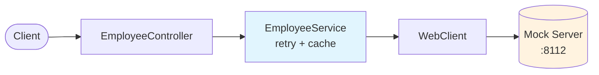
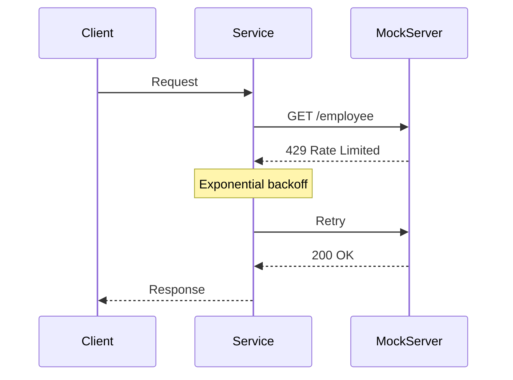

# Employee API Challenge

A REST API that wraps the Mock Employee API with **resilience for rate limiting**, **100+ tests**, and **clean architecture**. The mock server randomly returns 429 responses with 30-90 second backoff periods—this implementation handles that gracefully.

## Quick Start

### Prerequisites

- Java 25+ (api module) / Java 17 (server module)
- Gradle 9.2.1+ (wrapper included)
- SDKMAN recommended: run `sdk env` to auto-switch Java versions

### Run

```bash
# Check environment and start services
./doctor.sh --start

# Or manually:
./gradlew server:bootRun  # Terminal 1: Mock server (port 8112)
./gradlew api:bootRun     # Terminal 2: API (port 8111)
```

### Test the API

```bash
curl http://localhost:8111/api/v1/employee
curl http://localhost:8111/api/v1/employee/highestSalary
curl -X POST http://localhost:8111/api/v1/employee \
  -H "Content-Type: application/json" \
  -d '{"name":"Jane Doe","salary":75000,"age":28,"title":"Engineer"}'
```

### Run Tests

```bash
./gradlew test            # All tests
./gradlew api:test        # API module only
```

---

## Architecture



### Retry Behavior



### All 7 Endpoints

| Endpoint | Method | Description |
|----------|--------|-------------|
| `/api/v1/employee` | GET | All employees (cached) |
| `/api/v1/employee/search/{name}` | GET | Case-insensitive name search |
| `/api/v1/employee/{id}` | GET | Employee by UUID |
| `/api/v1/employee/highestSalary` | GET | Highest salary (integer) |
| `/api/v1/employee/topTenHighestEarningEmployeeNames` | GET | Top 10 earner names |
| `/api/v1/employee` | POST | Create employee (201) |
| `/api/v1/employee/{id}` | DELETE | Delete by ID (returns name) |

---

## Resilience Strategy

The mock server rate-limits randomly with 30-90 second backoff. The retry configuration handles this:

```
Attempt 1: immediate
Attempt 2: wait 10s
Attempt 3: wait 20s
Attempt 4: wait 40s
Attempt 5: wait 80s
─────────────────────
Total: up to 150s coverage
```

After 5 attempts, returns **503 Service Unavailable** with `Retry-After` header.

### Additional Resilience

- **Caching**: `getAllEmployees` cached for 30s to reduce rate-limit exposure
- **Correlation IDs**: Every request tagged for log tracing
- **Structured errors**: JSON responses with appropriate HTTP status codes

---

## Testing Approach

**100+ tests** covering retry behavior, error handling, edge cases, and full HTTP cycles.

### WireMock for Deterministic Tests

The mock server's random rate-limiting makes tests flaky. WireMock provides:
- Deterministic responses for reliable CI
- Scenario-based testing for retry sequences
- Fast execution (100ms retry delays vs 10s+ in production)

Test configuration uses shorter delays while production configuration matches the actual 30-90s server backoff.

---

## Technical Decisions

### Direct Service Architecture

Single service layer calling WebClient directly. Hexagonal architecture (ports/adapters) would add abstraction without benefit here—there's one data source and WireMock handles HTTP-level mocking.

### Consolidated Exception Handling

Three exception types route to appropriate HTTP responses:
- `EmployeeNotFoundException` → 404
- `TooManyRequestsException` → triggers retry, then 503
- `EmployeeServiceException` → 502 with details

A `GlobalExceptionHandler` maps these consistently across all endpoints.

### Fail-Fast on 5xx

Only 429 triggers retry. Server errors (5xx) return immediately as 502—retrying won't fix upstream bugs, and fail-fast lets clients implement their own strategies.

### Delete by ID

The mock server requires employee name for deletion, but the API receives an ID. The implementation fetches the employee first, creating a brief race window. Production would need an ID-based delete endpoint or optimistic locking.

---

## Configuration

```yaml
employee:
  client:
    base-url: http://localhost:8112/api/v1/employee
    connect-timeout: 5s
    read-timeout: 10s
    retry:
      max-attempts: 5
      delay: 10000      # 10 seconds
      multiplier: 2.0
  cache:
    ttl-seconds: 30
```

---

## Future Improvements

For production deployment, see **[FUTURE_IMPROVEMENTS.md](FUTURE_IMPROVEMENTS.md)** which covers:
- Circuit breaker patterns
- Metrics and distributed tracing
- OpenAPI documentation
- Additional edge case handling
