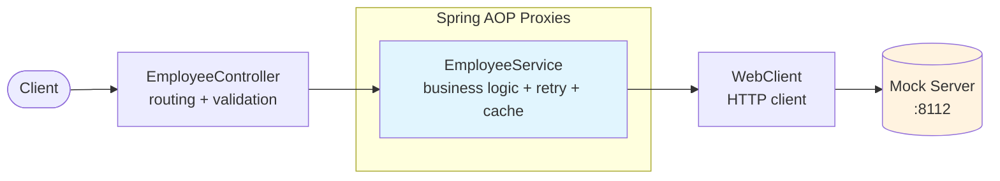
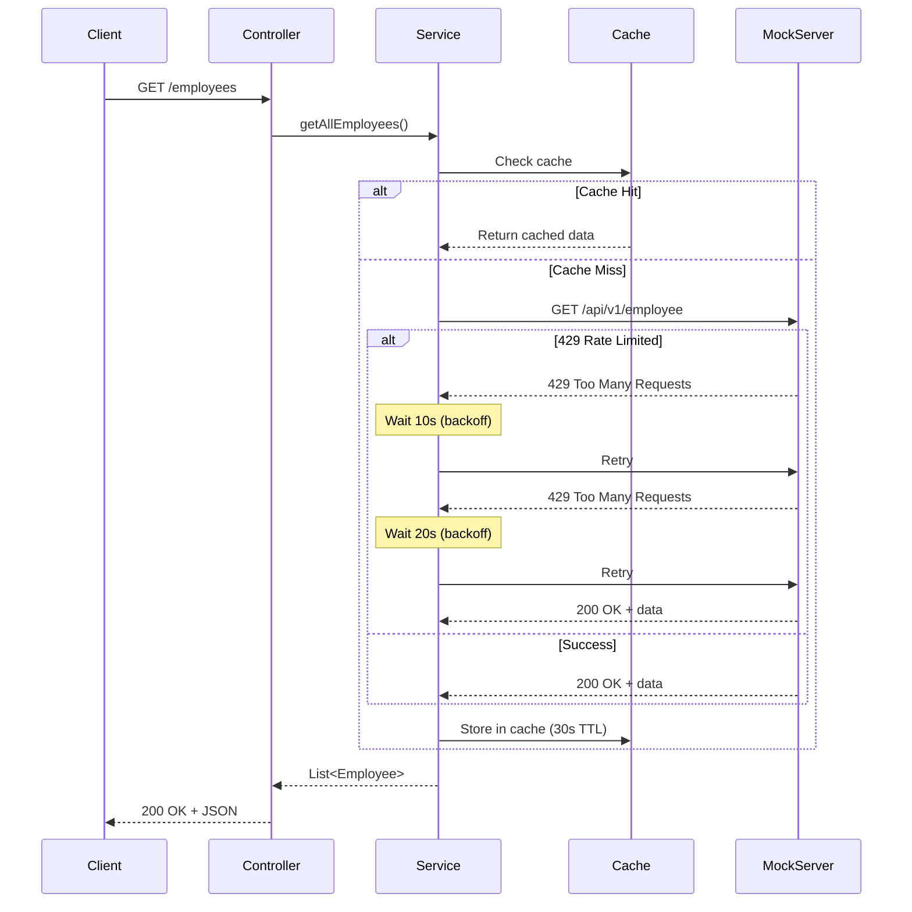

# ReliaQuest Coding Challenge - Solution

## Design Decisions

**This section explains what was built, what was deliberately omitted, and why.**

### Why Retry with Exponential Backoff

The mock server randomly rate-limits requests (429 responses) with a **30-90 second backoff period**. This is the core technical challenge of the assignment.

**Solution**: Implemented `@Retryable` with exponential backoff configured to match the server's backoff:
- **Runtime**: 5 attempts, 10s → 20s → 40s → 80s (covers up to 150s total wait)
- **Tests**: 3 attempts, 100ms delays (fast execution with WireMock)

**Why different configurations**: The mock server's aggressive rate limiting (30-90s) requires patient retry in production, but tests use WireMock with deterministic responses so can run fast.

**Why this is appropriate**: Rate limiting is explicitly mentioned in the requirements. Retry logic directly addresses the stated problem and demonstrates understanding of real-world resilience patterns.

### Why NOT Hexagonal Architecture

A hexagonal/ports-and-adapters architecture (separate Port interface + Adapter implementation) would add abstraction layers without benefit for this use case.

**What would justify hexagonal architecture**:
- Multiple data sources (database + external API)
- Need to swap implementations (test doubles, different vendors)
- Large team needing clear boundaries

**Why it's omitted here**:
- Single data source (one HTTP API)
- Service layer can call WebClient directly with no loss of clarity
- Tests use WireMock for HTTP-level mocking (industry standard)
- Fewer files = faster code review and easier understanding

**In production**: If this API needed to support multiple backends or required extensive unit testing with mocks, I would add the port/adapter abstraction.

### Why Consolidated Exception Hierarchy

The implementation uses 3 exception types:
- `EmployeeNotFoundException` - 404 for missing resources
- `TooManyRequestsException` - 429 for retry logic (needed for `@Retryable`)
- `EmployeeServiceException` - all other service errors with HTTP status

**Why not 5-6 separate exception types**: The `GlobalExceptionHandler` routes exceptions to HTTP responses. A single exception with an `HttpStatus` field achieves the same result with less code.

### Why NOT Retry on 5xx Server Errors

Only 429 (rate limiting) triggers retry. Server errors (5xx) return immediately as 502 Bad Gateway.

**Why this is appropriate**:
- The mock server's documented behavior is rate limiting (429), not server failures
- 5xx errors indicate server bugs or infrastructure issues—retrying won't help
- Retrying on 5xx could mask upstream problems that need investigation
- Fail-fast allows clients to implement their own retry strategies

**In production**: If the upstream server had transient 5xx errors (e.g., 503 during deployments), I would add retry logic with a circuit breaker to prevent cascading failures.

### Known Limitations

**deleteEmployeeById has a race condition**

The mock server requires the employee name for deletion, but the controller receives an ID. The implementation:
1. Fetches the employee by ID
2. Deletes by name

Between steps 1 and 2, another process could delete or rename the employee.

**In production**: Request an ID-based delete endpoint, or implement optimistic locking.

### What Would Be Added in Production

| Feature | When Needed | Why Omitted |
|---------|-------------|-------------|
| Circuit breaker | When downstream failures cause cascading issues | Retry with timeout handles the mock server's rate limiting |
| OpenAPI/Swagger | When API is consumed by external teams | Self-documenting code sufficient for interview context |
| Metrics (Micrometer) | When operating at scale with monitoring | No observability stack to consume the metrics |
| Distributed tracing | When debugging spans multiple services | Single service, correlation IDs sufficient |

For a complete list of future improvements and technical debt from code reviews, see **[FUTURE_IMPROVEMENTS.md](FUTURE_IMPROVEMENTS.md)**.

---

## Solution Overview

A REST API that consumes the Mock Employee API with emphasis on **appropriate scoping**, **resilience**, and **test coverage**.

### Architecture



**Request flow:**
1. **Controller** validates input and routes to service
2. **Service** applies business logic (search, filter, sort)
3. **@Cacheable** returns cached data or proceeds to HTTP call
4. **@Retryable** handles 429 responses with exponential backoff
5. **WebClient** makes HTTP request to mock server

### Sequence: Rate Limiting with Retry



The service layer handles:
- Business logic (search, filter, sort)
- HTTP client calls (WebClient)
- Retry logic (`@Retryable` with exponential backoff)
- Caching (`@Cacheable` for getAllEmployees)

### Resilience Features

**Rate Limiting Handling**
- **Retry**: 5 attempts with exponential backoff (10s → 20s → 40s → 80s) to cover 30-90s server backoff
- **Caching**: In-memory cache for getAllEmployees (30s TTL)
- **Recovery**: Service unavailable (503) after retry exhaustion
- **Test config**: Fast retry (100ms delays) with WireMock for deterministic tests

**Error Handling**
- Correlation IDs in all log entries
- Structured JSON error responses
- Appropriate HTTP status codes (400, 404, 429, 500, 502, 503)

### All 7 Endpoints Implemented

| Endpoint | Method | Description |
|----------|--------|-------------|
| `/employees` | GET | Returns all employees (cached) |
| `/employees/search/{searchString}` | GET | Case-insensitive name search |
| `/employees/{id}` | GET | Get employee by UUID |
| `/employees/highestSalary` | GET | Returns highest salary integer |
| `/employees/topTenHighestEarningEmployeeNames` | GET | Top 10 earners (names only) |
| `/employees` | POST | Create employee (returns 201) |
| `/employees/{id}` | DELETE | Delete by ID (returns name) |

### Testing Strategy

- **Integration tests**: WireMock-based tests verifying retry behavior, error handling, and full HTTP cycles
- **Unit tests**: Exception handler, controller routing, domain model validation

**Why WireMock instead of the Mock Server?**

The mock server randomly rate-limits requests, making tests flaky. WireMock provides deterministic control over responses for reliable CI.

---

## Getting Started

### Prerequisites

- Java 25+ (for api module - use `sdk env` if you have SDKMAN)
- Gradle 9.2.1+ (wrapper included)

> **Note**: The server module (mock server) uses Java 17 as provided. The api module (my implementation) uses Java 25.

### Quick Start

```bash
# Check environment and optionally start services
./doctor.sh --start

# Or manually:
./gradlew server:bootRun  # Terminal 1: Start mock server
./gradlew api:bootRun     # Terminal 2: Start API
```

### Running Tests

```bash
./gradlew test            # All tests
./gradlew api:test        # API module only
```

### Code Formatting

```bash
./gradlew spotlessApply   # Apply Palantir Java Format
```

---

## Configuration

Key properties in `application.yml`:

```yaml
employee:
  client:
    base-url: http://localhost:8112/api/v1/employee
    connect-timeout: 5s
    read-timeout: 10s
    retry:
      # Configured for mock server's 30-90s rate limit backoff
      max-attempts: 5
      delay: 10000  # 10 seconds
      multiplier: 2.0
  cache:
    ttl-seconds: 30
```

---

## API Reference

### Mock Employee API (Port 8112)

The mock server generates random employee data on startup and randomly rate-limits requests.

See the original challenge documentation for endpoint details.
